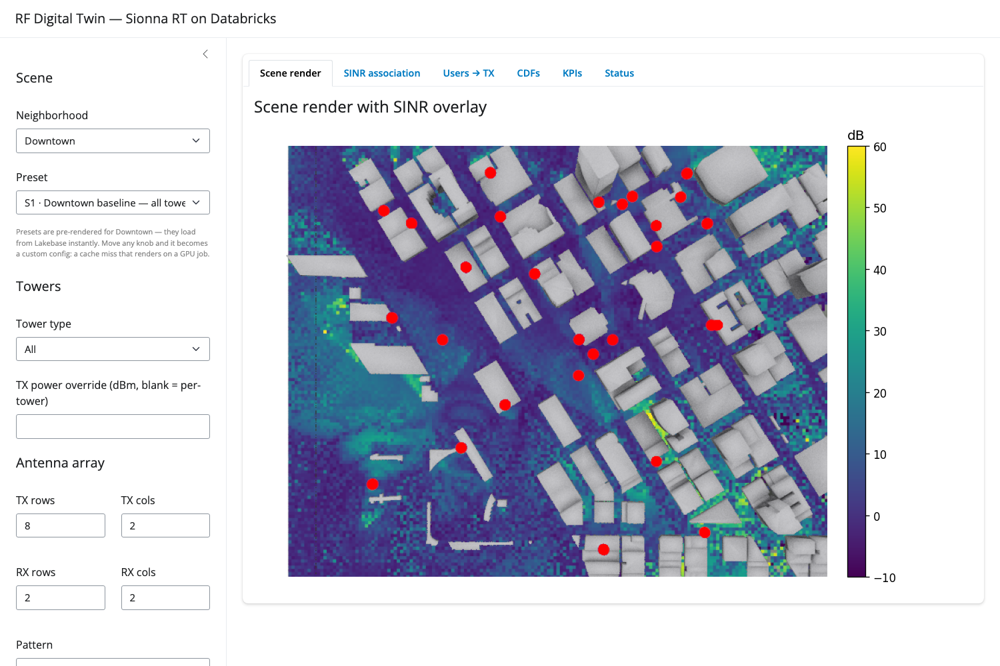

# Sionna RT on Databricks — an RF Digital Twin served from Lakebase

**The claim this repo proves:** NVIDIA Sionna RT ray tracing runs on Databricks end to end — real
network data out of Unity Catalog, real building geometry, GPU compute on a job cluster, and the
results served back to an interactive app fast enough to feel instant.

Not a synthetic toy scene. The transmitters are **actual T-Mobile towers** read from a Unity Catalog
table; the buildings are **OpenStreetMap footprints** for the block being rendered; the propagation
is a full Sionna RT radio-map solve on an A10G GPU. One app, one story.



---

## The loop

Everything here exists to make one loop fast:

```
   sidebar knobs ──▶ config_hash ──▶ Lakebase lookup
                                       │
                       cache hit ◀─────┤  5–15 ms: PNGs + KPIs straight back
                                       │
                       cache miss ─────┴─▶ GPU job (Sionna RT) ─▶ writes cache ─▶ app polls it up
```

A render is expensive (minutes on a GPU) and **deterministic** — the same scene, towers and tracing
parameters always produce the same output. That combination is exactly what a cache is for. So the
app never renders anything itself: it hashes the config, and either finds the answer or asks a GPU
job to produce it.

That makes the demo honest about both halves. Cached configs load in milliseconds. Uncached ones
cost a cluster and you watch the job run.

### Why Lakebase for the cache

The hot path is "fetch ~1 MB of PNG bytes by primary key, now." That's an OLTP read, not an
analytical scan:

| Workload | Lakebase (CU_1, auto-stop) |
| --- | --- |
| Cold path (instance paused) | ~5–15 s resume, then 5–15 ms |
| Warm hit, single row by `config_hash` | **5–15 ms** |
| Single ~1 MB PNG blob fetch | 20–50 ms |
| Sustained QPS per instance | 1 000+ |

The app holds an open `psycopg` connection, so a steady-state read is one round-trip plus an indexed
PK lookup plus a `bytea` fetch — ordinary Postgres territory. A serverless SQL warehouse doing the
same job pays a ~250 ms floor per lookup (handshake + planning + Thrift transport) and 30–60 s on
cold start, which is the difference between an app that feels instant and one that feels like a
report. Lakebase also auto-pauses, so an idle demo is cheap.

Credentials are never stored: the app mints a short-lived OAuth token via the Databricks SDK and
caches it ~45 min (`lakebase_client._generate_password`).

---

## Architecture

```
   ┌─────────────────────────────────────────────────────────────────────────┐
   │  UNITY CATALOG                                                          │
   │  cmegdemos_catalog.network_analytics_enablement.cell_towers              │
   │  2,312 T-Mobile towers · geometry(4326) · read via a SQL warehouse       │
   └────────────────────────────────────┬────────────────────────────────────┘
                                        │  towers.load_towers()
                                        ▼
   ┌─────────────────────────────────────────────────────────────────────────┐
   │  scene_spec.resolve()   ← the one code path the app AND the job share   │
   │  ─ project towers to local metres, derive per-tower band/height/power   │
   │  ─ tile the neighborhood (800 m + 150 m margin), pick the densest tile  │
   │  ─ apply the story's tower filter / power override                     │
   │  ⇒ (scene_cfg, cells) ⇒ compute_config_hash() ⇒ the cache key           │
   └───────────────┬─────────────────────────────────────┬───────────────────┘
                   │                                     │
    cache hit      ▼                                     ▼   cache miss
   ┌───────────────────────────────┐            ┌────────────────────────────┐
   │  LAKEBASE (Postgres)          │            │  GPU JOB — Sionna RT       │
   │  ─ scene_configs  config+hash │◀── writes ─│  g5.xlarge (A10G), DBR 16.4│
   │  ─ cell_configs   the towers  │            │  ─ OSM buildings → Mitsuba │
   │  ─ cached_renders PNGs + KPIs │            │  ─ RadioMapSolver          │
   │  ─ compute_jobs   run status  │            │  ─ asserts hash parity     │
   └───────────────┬───────────────┘            └────────────────────────────┘
                   │  5–15 ms reads                          ▲
                   ▼                                         │ Jobs API + 10 s poll
        ┌──────────────────────────┐                         │
        │  DATABRICKS APP (Shiny)  │─────────────────────────┘
        │  6 tabs, parametric side │
        └──────────────────────────┘
```

### The part that's easy to get wrong

The cache key folds in every tower's position, height, power, band and array
(`lakebase_client._HASH_CELL_FIELDS`) plus the neighborhood and tile. So **the app has to resolve
the identical tower set the job rendered**, or its hash won't match and every lookup misses.

Two things make that hold:

1. **One shared module.** `scene_spec.py` owns tile geometry and tower resolution, and both the app
   and `render_pipeline` import it. It deliberately doesn't import `sionna_compute` (that pulls in
   drjit/mitsuba, which can't load in an app container), so the same code runs in both places.
2. **The job re-derives and checks.** On a cache miss the app sends only the knobs — not 30 towers
   of geometry. `render_custom` rebuilds the towers itself and asserts the hash it computes equals
   the one the app is polling for, failing loudly on mismatch rather than caching a row nothing
   will read.

There's a subtle trap here worth naming, because it cost real debugging time: hashing raw
full-precision floats is **not portable**. `math.cos` in the lat/lon projection differs by 1 ULP
between macOS arm64 and Linux x86_64, so the same config hashed differently depending on which
machine hashed it — every preset a cache miss. `compute_config_hash` now quantizes floats to 6 dp
(sub-micron on metre coordinates, far below what the ray tracer resolves) before hashing.

Run `tools/check_hash_parity.py` after touching anything hash-relevant. It asserts every preset
still resolves to a cached render:

```bash
DATABRICKS_CONFIG_PROFILE=<profile> python tools/check_hash_parity.py
```

---

## The preset gallery

Seven configs are pre-rendered for **Downtown Seattle** (~125 towers; the densest 800 m tile holds
30). Each holds everything steady and flips one knob, so you're comparing like with like. Pick one
from the sidebar's **Preset** dropdown and it loads from Lakebase instantly.

| Preset | What changes | Towers rendered |
| --- | --- | --- |
| **S1 · Downtown baseline** | all towers @ 3.5 GHz, 8×2 array | 30 |
| **S2 · Densification** | 16×16 massive MIMO | 30 |
| **S3 · 5G NR mmWave layer** | NR towers only @ 28 GHz, 400 MHz | 13 |
| **S4 · LTE coverage layer** | LTE towers only @ 1.8 GHz, 20 MHz | 15 |
| **S5 · High power** | every tower forced to 50 dBm | 30 |
| **S6 · Fidelity** | `max_depth` 3 → 5 (more multipath) | 30 |
| **S7 · Wide bandwidth** | 400 MHz channel | 30 |

Move **any** sidebar knob off a preset and the dropdown flips to *Custom*: that config is a cache
miss, and rendering it submits the GPU job. Move the knob back and the preset — and its instant
cache hit — returns.

Per-tower frequency, antenna height and power are drawn deterministically from a fixed seed
(`towers.randomize_config`), keyed on `tower_id`, so the tower population is realistically
heterogeneous but perfectly reproducible.

**Sidebar defaults are the approximation settings** — 10⁶ samples/TX, `max_depth` 3, 5 m cells —
which keep a 30-tower tile in the minutes range. They're deliberately not the 10⁷/depth-5/1 m
settings a single-scene demo can afford; see the tables below for why.

---

## Where the time goes

One Sionna render breaks down roughly as:

| Stage | What it does | Share |
| --- | --- | --- |
| **`RadioMapSolver`** | Ray tracing — fires `samples_per_tx` rays per TX, traces to `max_depth` bounces, computes per-cell SINR / RSS / path gain. **GPU-bound.** | **85–95 %** |
| `scene.render` | Top-down 3D render with the radio map overlaid. | 3–5 % |
| `radio_map.show_association` | SINR-best-TX assignment as a 2D image. | 1–2 % |
| `sample_positions` + user plot | Samples users per TX, colours them by serving TX. | 1–2 % |
| `radio_map.cdf` ×2 | SINR and RSS CDFs over the cell grid. | 1–2 % |
| Lakebase write | PNG `bytea` + KPI JSON insert. | <1 % |
| OSM fetch (first time per tile) | Overpass query + mesh build, then cached on disk. | varies |

Solver cost is roughly `O(num_tx × samples_per_tx × max_depth)` — linear in towers, linear in
samples, super-linear in depth. The knobs that move it most:

| Knob | Approximation used here | Full fidelity | Effect |
| --- | --- | --- | --- |
| `samples_per_tx` | 10⁶ | 10⁷ | 10× time; noisier shadows when low |
| `max_depth` | 3 | 5–8 | each bounce ~doubles traversal cost |
| `cell_size` | 5 m | 1 m | 25× the map tensor per TX |
| TX array | 8×2 | 16×16 | 5–10 % slower per ray |

### Render time — GPU × tower count

Per single render, `samples_per_tx=10⁷`, `max_depth=5`, `cell_size=1 m`. Planning estimates, ±30 %.

| Compute ↓ / towers → | **7** | **25** | **50** | **100** | **250** | **500** |
| --- | --- | --- | --- | --- | --- | --- |
| CPU only (`c5.4xlarge`) | 30–45 min | 1.5–2 h | 3–4 h | 6–8 h | 16+ h | OOM† |
| `g4dn.xlarge` (T4) | 4–6 min | 15–20 min | 30–40 min | 60–90 min | 4–5 h | OOM† |
| **`g5.xlarge` (A10G)** ← *this repo* | 2–3 min | 7–10 min | 15–25 min | 30–45 min | 2–3 h | OOM† |
| `g5.12xlarge` (4× A10G) | 1.5–2 min | 3–5 min | 6–10 min | 10–15 min | 30–45 min | 1–1.5 h |
| `p4d.24xlarge` (8× A100) | 1–1.5 min | 1.5–3 min | 3–5 min | 5–8 min | 12–18 min | 25–35 min |

† 24 GB-VRAM GPUs run out of memory when many TXs meet a fine `cell_size` and high
`samples_per_tx`. Mitigations: coarsen `cell_size` to 2–5 m, drop to 10⁶ samples, cap towers per
tile (this repo caps at 30, `scene_spec.TOWER_CAP`), or move to multi-GPU.

Post-processing is ~30–60 s of fixed overhead regardless of tower count.

### Serving latency — cached rows × concurrent users

Median wall-clock for one render pulling **N cached rows**, at **Lakebase CU_4**, warm, ~1 MB per
row. One row = one preset; 500 rows ≈ a metro-wide tile overlay.

| Cached rows / render | **1 user** | **10** | **50** | **200** | **1 000** |
| --- | --- | --- | --- | --- | --- |
| **1** | 10 ms | 12 ms | 15 ms | 30 ms | ~150 ms |
| **7** | 20 ms | 25 ms | 35 ms | 80 ms | ~400 ms |
| **25** | 60 ms | 70 ms | 120 ms | 300 ms | ~1 s |
| **100** | 200 ms | 250 ms | 450 ms | 1 s | ~3 s |
| **500** | 700 ms | 1 s | 2 s | 4 s | saturating |

Rows come back in one round-trip via an `IN (…)` lookup, so it scales roughly linearly in both axes
until the instance saturates on CPU or network. `CU_4` → `CU_8`/`CU_16` roughly halves saturation
latency per step.

### Cost shape (rough monthly, AWS list)

| Traffic | Lakebase (CU_1, auto-stop on) |
| --- | --- |
| Light, intermittent (~10 req/hr) | ~$20–60/mo (mostly paused) |
| Steady (~100 req/hr) | ~$100–200/mo |
| Heavy (1 000+ req/hr) | ~$200–400/mo |
| Always-on (auto-stop off) | ~$200/mo on top of the above |

GPU render cost is separate and only paid on a cache miss: a `g5.xlarge` job cluster is a few
dollars an hour, and a 30-tower tile at the approximation settings is minutes.

---

## How this scales to a metro

### Pre-compute by area, serve from cache

Treat the simulation as a **data product**. Sionna's output is deterministic per (scene, towers,
tracing params) — ideal for offline materialization. This repo already implements the mechanics:
`tiling.py` splits a neighborhood into 800 m tiles with a 150 m margin, assigns towers, and caps
each tile; `render_pipeline.render_coverage` batch-renders them; `calibrate` measures one tile and
recommends a batch size that lands each job in a ~25 min window.

Scaled up: tile the city (H3 res 7–9, or rectangles), render each tile once with its current tower
layout, and re-render **only tiles whose layout changed** — driven by a Lakeflow job off the
`scene_configs` hash. The app stitches tiles for the visible viewport. A one-time full-city render
is real money (≈1 000 tiles × 5 min on A10G ≈ 80 GPU-hours), but you pay it once and then serve in
milliseconds.

Put the hot path in Lakebase (`config_hash` → PNGs + KPIs) and the raw radio-map tensors and
historical comparisons in Delta + UC Volumes, where "SINR p10 across all tiles by month" is a SQL
query.

### Approximate the simulation

When you don't need photorealistic tracing, the knobs in the table above each buy 10–100×. The
bigger unlock is an **ML surrogate**: generate (config → radio map) pairs with parallel Sionna
renders on a GPU pool, store them in Delta + UC Volumes, train a small CNN/U-Net with Mosaic AI
Model Training, register it in MLflow/UC, and serve it scale-to-zero on Mosaic AI Model Serving.
The app then shows surrogate output during interactive edits (sub-second) and fires a real Sionna
render on commit — both writing into the same cache, so later lookups land on whichever is fresher.
Lakehouse Monitoring compares surrogate predictions against periodic ground-truth renders and
triggers retraining on drift.

The point is that all of it — GPU training, Postgres serving, Delta storage, model registry,
dashboards — sits in one workspace under one Unity Catalog permission model, with the training
corpus and the production table being the same table.

### The hybrid, at real scale

```
   ┌────────────────────────────────────────────────────────────────────┐
   │  Lakehouse (Delta + UC)  ←  Sionna RT writes here                  │
   │  system of record + analytics surface (BI, surrogate training)      │
   └─────────────────────────────────┬──────────────────────────────────┘
                                     │  Lakeflow / CDC
                                     ▼
   ┌────────────────────────────────────────────────────────────────────┐
   │  Lakebase (Postgres)  ←  read-through hot cache                    │
   │  mirrors the latest cached_renders row · sub-30 ms · 1 000+ QPS     │
   └─────────────────────────────────┬──────────────────────────────────┘
                                     ▼
                                ┌─────────┐
                                │   App   │   reads only here
                                └─────────┘
```

Delta is the source of truth and the analytics surface; Lakebase is a thin read cache fed by a
Lakeflow pipeline. The app talks only to Lakebase; analysts query Delta. Each is sized for its
actual workload.

---

## Deploy it

Prerequisites: a Lakebase instance, a serverless SQL warehouse, a tower table like `cell_towers`
(`tower_id, carrier, tower_type, coverage_radius_m, latitude, longitude`), and GPU-capable job
compute.

**1. Render the preset gallery** (once, ~30–50 min on `g5.xlarge`). Run
`App/rf-digital-twin-lakebase/setup/setup_lakebase_twin.py` as a notebook on a GPU cluster. It
creates the Postgres schema and tables, registers the neighborhoods, calibrates batch size, and
renders S1–S7 into the cache. It's idempotent — re-running only renders what isn't already cached.

**2. Create the render job** from `jobs/render_job.py`:

```
single node · g5.xlarge driver · DBR 16.4.x-scala2.13 · SINGLE_USER
libraries: drjit mitsuba sionna-rt psycopg[binary]>=3.1.18 databricks-sdk>=0.55.0
           requests shapely trimesh mapbox_earcut
spark_env_vars: SEATTLE_SQL_WAREHOUSE_ID=<warehouse id>   PG_SCHEMA=<your schema>
```

`mapbox_earcut` is not optional — without it trimesh can't triangulate building footprints and the
OSM buildings silently vanish from the scene. Internet egress is required (Overpass API).

**3. Create the app** pointing at `App/rf-digital-twin-lakebase`, and set `SIONNA_RENDER_JOB_ID` in
`app.yaml` to the job you just made.

**4. Grant the app's service principal** — this is where a fresh app most often half-works:

| Grant | Why |
| --- | --- |
| Lakebase resource binding → instance + database | injects `PGHOST`/`PGPORT`/`PGDATABASE`/`PGUSER`; the app mints `PGPASSWORD` itself |
| `CAN MANAGE RUN` on the render job | so a cache miss can trigger a render |
| `CAN_USE` on the SQL warehouse | reads the tower table |
| `SELECT` on the tower table, plus `USE_CATALOG` / `USE_SCHEMA` on its parents | without all three the tower load 403s and **no config can be hashed** |

**5. Verify** with `tools/check_hash_parity.py` before showing it to anyone. If the presets don't
resolve to cached renders, the demo's whole "instant" claim is gone and you want to know first.

Migrating a cache from another schema? `tools/seed_schema_from_seattle.py` copies rendered rows into
a new schema, re-keyed onto the current hash — no GPU re-render.

---

## Repo layout

```
.
├── README.md
├── rf_planning_optimization/
│   └── simulation_RT_light.ipynb            # the original single-shot notebook
└── App/rf-digital-twin-lakebase/
    ├── app.py                               # Shiny UI + server: hash → cache → job → poll
    ├── app.yaml                             # Databricks Apps config (no --reload; see below)
    ├── requirements.txt
    ├── defaults.py                          # the S1–S7 stories + knob dataclass
    ├── neighborhoods.py                     # 8 Seattle boxes + lat/lon → local-metre projection
    ├── towers.py                            # UC tower read (via SQL warehouse) + per-tower config
    ├── tiling.py                             # tile grid, tower assignment, batch sizing
    ├── scene_spec.py                         # ★ shared resolution — app and job hash through this
    ├── osm_scene.py                          # Overpass → extruded meshes → Mitsuba scene
    ├── sionna_compute.py                     # the Sionna RT pipeline (GPU-side only)
    ├── render_pipeline.py                    # custom / stories / coverage orchestration
    ├── lakebase_client.py                    # Postgres schema, OAuth, hashing, reads/writes
    ├── setup/setup_lakebase_twin.py           # one-shot: schema + preset gallery
    ├── jobs/render_job.py                     # the GPU job (mode=custom | stories | coverage)
    └── tools/
        ├── check_hash_parity.py               # the gate: presets must resolve to cached renders
        └── seed_schema_from_seattle.py        # copy a cache into a new schema, re-keyed
```

Two hard-won notes on `app.yaml`: **never add `--reload`** (it kills the Shiny session websocket in
Databricks Apps and every panel renders blank), and keep `connect_timeout` on the Postgres
connection so an unreachable endpoint fails fast instead of hanging the app.

---

## Further reading

- [Sionna RT documentation](https://nvlabs.github.io/sionna/rt/index.html)
- [Lakebase docs](https://docs.databricks.com/aws/en/oltp/) — managed Postgres on Databricks
- [Databricks Apps docs](https://docs.databricks.com/aws/en/dev-tools/databricks-apps/)
- Medium series this project grew out of:
  - [Part I — "NVIDIA's AI-Native Digital Twin on Databricks"](https://medium.com/@razibayati20/nvidias-ai-native-digital-twin-on-databricks-true-ai-democratization-for-telecom-bdb81ef87b70)
  - [Part II](https://medium.com/@razibayati20/nvidias-ai-native-digital-twin-on-databricks-true-ai-democratization-for-telecom-ii-065938ca112c)
